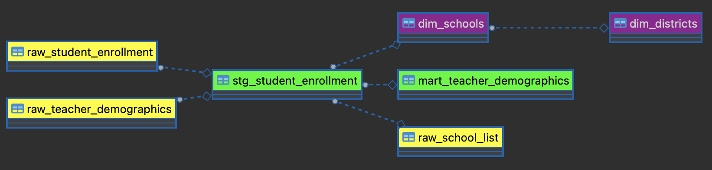

# CCER Data Engineer Assessment
## Jono Q Green
## January 26, 2023

### Overview
This repository contains all the work I've done for this challenge. The scripts are numbered in order to indicate a sequence in which they would run to complete the data pipeline. Note that they are not numbered sequentially - rather, I've grouped them roughly as follows:

* Scripts beginning with 0 fetch data
* Scripts beginning with 1 load and validate raw data
* Scripts beginning with 2 transform data
* Scripts beginning with `create_raw` are called indirectly from other scripts

There are also gaps between in file numbers in case other scripts need to be added - that way, not all files need be renumbered.

Note that I started an attempt to use dbt for some of the transformation steps, and then abandoned it when I ran out of time. Some of the vestiges of that attempt remain (primarily .yml files and scripts marked .ignore).

In general, I used Python to fetch and load data (primarily I used `psycopg2` to do the heavy lifting, but I also used `pandas` and `numpy` to assist with cleaning and loading the CCER school list due to its fixed-width format), and I used PostgreSQL for transformations, modeling, and analysis.

---
### Data Ingestion
---
*1. Scrape or integrate the datasets from the webpage and flat file sources*

See scripts:
* `0010_fetch_student_enrollment_data.py`
* `0020_fetch_teacher_demographics_data.py`

---
*2. Import the datasets as tables into a SQL database on your local machine*

See scripts:
* `0110_load_student_enrollment_data.py`
* `0120_load_teacher_demographics_data.py`
* `0130_load_school_list.py`

 *a. Consider a cloud-based database. Why or why not?*
 
 The main reason I did not use a cloud-based database is because I have extensive experience with local databases and limited experience with Azure, and the time constraints for the assignment became obvious quite quickly. Additionally, even though these data don't seem particularly sensitive, there can be security concerns with using a cloud database.

*b. Do you develop validations, unit tests, or integration tests on this ingestion program?*

*i. Why or why not?*

I chose to import the data first using primarily untyped text fields before developing validations in the interest of time. With the benefit of additional time, I probably would create validations within pandas so that I could bring the data in already typed and handle any unepexected format errors before importing into tables with more specifically typed column formats.

Post-import validations:
* `0115_raw_student_enrollment_validations.sql`
---
*3. Standardize the schemas to simplify the data transformation process
a. Pivot the enrollments table to create a separate row to store the information in each demographic column before importing into the database.*

I pivoted the enrollments table here (post-raw load):
* `0210_create_stg_student_enrollment.sql`

The teacher demographic data were more normalized, at least as far as demographic fields, so in the interest of time I left them as-is, worked with them raw, and moved on.

---

### Data Orchestration

---

*4. Provide a mechanism or interface for orchestrating the data pipeline. This could be simple or complex, but think about how you would handle these datasets updating regularly at the source or stakeholders escalating a need to ingest it on a regular basis.*

In thinking about how to orchestrate the pipeline I decided to add the numbered prefixes to my script files to indicate precedence.

I would likely keep things simple - a cronjob that scrapes the "as of" date on the source data websites and downloads new files and triggers the rest of the pipeline as needed would probably suffice. (I'm open to learning new tools if there's a particular need for something more sophisticated, but I know crontab the best.)

---
### Data Transformation
---
*5. In step 3, you standardized the schemas. Did you use a data transformations tool to do this?*

No. As noted above, I made an attempt to use dbt, but I had syntax errors in my models and not enough time to track down the issues.

---
*6. Begin creating data models that can help analysts begin leveraging this data to answer
stakeholders' questions*

*a. Develop a model that normalizes these source tables into relevant dimension tables*

*i. Schools*

* `0220_create_dim_schools.sql`

*ii. Districts*

* `0230_create_dim_districts.sql`

*iii. Races/Ethnicities,*
*iv. Etc. (get creative!)*

* [Did not complete]

*b. Please submit a diagram or picture summarizing your schema design from source data to the data-modeling layer (DML)*

* 

*i. How do you standardize and separate your sources from your core data models?*

* For this exercise, I relied on naming conventions to keep source (`raw_`), staged (`stg_`), and dimension (`dim_`) data separated. With more time, I would've isolated by schema.
--- 
*7. Develop relevant data transformations that can answer the below questions:*

*a. For each school type (high school, middle school, elementary school), please show the top 5 schools with the highest percentage of each of the following groups of students:*

* `model_7a.sql`

*i. Black students*

level|school_code|school_name|city|race|pct
-----|---------|------|----|-----|----
Elementary school|2645|West Seattle Elementary School|SEATTLE|Black|0.7253
Elementary school|2143|John Muir Elementary School|SEATTLE|Black|0.5637
Elementary school|3581|Wing Luke Elementary School|SEATTLE|Black|0.5505
Elementary school|2929|Lakeridge Elementary School|Seattle|Black|0.5422
Elementary school|2089|Martin Luther King Jr. Elementary School|SEATTLE|Black|0.5032
High school|3327|Rainier Beach High School|SEATTLE|Black|0.4289
High school|2182|Franklin High School|SEATTLE|Black|0.2750
High school|2475|Renton Senior High School|Renton|Black|0.2563
High school|2306|Garfield High School|SEATTLE|Black|0.2483
High school|2392|Cleveland High School STEM|SEATTLE|Black|0.2378
Middle school|4218|South Shore PK-8 School|SEATTLE|Black|0.4884
Middle school|3774|Aki Kurose Middle School|Seattle|Black|0.3181
Middle school|4064|Washington Middle School|SEATTLE|Black|0.2995
Middle school|3280|Dimmitt Middle School|Seattle|Black|0.2907
Middle school|4065|Orca K-8 School|SEATTLE|Black|0.2783

*ii. Native American students (listed in the source file as American Indian/ Alaskan Native)*

level|school_code|school_name|city|race|pct
----|----|----|----|----|----
Elementary school|3439|Chinook Elementary School|AUBURN|Native American|0.0894
Elementary school|3032|Southern Heights Elementary|Seattle|Native American|0.0208
Elementary school|2199|Concord International School|SEATTLE|Native American|0.0152
Elementary school|3568|Lake Grove Elementary School|FEDERAL WAY|Native American|0.0152
Elementary school|3389|Scenic Hill Elementary School|Kent|Native American|0.0146
High school|5371|Highline Home School Center|Burien|Native American|0.1000
High school|2795|Auburn Senior High School|AUBURN|Native American|0.0214
High school|3096|Chief Sealth International High School|SEATTLE|Native American|0.0106
High school|3279|Mount Rainier High School|Des Moines|Native American|0.0102
High school|2848|Foster Senior High School|Tukwila|Native American|0.0093
Middle school|5371|Highline Home School Center|Burien|Native American|0.1000
Middle school|3169|Olympic Middle School|AUBURN|Native American|0.0375
Middle school|3163|Cascade Middle School|Seattle|Native American|0.0127
Middle school|3280|Dimmitt Middle School|Seattle|Native American|0.0125
Middle school|2564|Showalter Middle School|SEATTLE|Native American|0.0115

*iii. Latine student (listed in the source file as Hispanic/ Latino of any race(s))*

level|school_code|school_name|city|race|pct
----|----|----|----|----|----
Elementary school|3669|Gildo Rey Elementary School|AUBURN|Latine|0.6628
Elementary school|2144|Mount View Elementary|Seattle|Latine|0.6358
Elementary school|3165|Hilltop Elementary|Seattle|Latine|0.6166
Elementary school|3227|Pioneer Elementary School|AUBURN|Latine|0.6070
Elementary school|3278|Madrona Elementary|SeaTac|Latine|0.5707
High school|3099|Evergreen High School|Seattle|Latine|0.4856
High school|2325|Highline High School|Burien|Latine|0.4793
High school|3483|Tyee High School|SeaTac|Latine|0.4299
High school|2417|Federal Way High School|FEDERAL WAY|Latine|0.4009
High school|3584|Thomas Jefferson High School|AUBURN|Latine|0.3590
Middle school|5551|Glacier Middle School|SeaTac|Latine|0.5454
Middle school|3163|Cascade Middle School|Seattle|Latine|0.4746
Middle school|3169|Olympic Middle School|AUBURN|Latine|0.4458
Middle school|3626|Sacajawea Middle School|FEDERAL WAY|Latine|0.4194
Middle school|3098|Chinook Middle School|SeaTac|Latine|0.4053

*b. Create a schools dataset that shows the total number of teachers at each school*

* `model_7b.sql`

school_code|school_name|city|elementary_school_flag|middle_school_flag|high_school_flag|teacher_total_count
----|----|----|----|----|----|----
2797|Kent-Meridian High School|Kent|0|0|1|109
2795|Auburn Senior High School|AUBURN|0|0|1|101
4474|Auburn Riverside High School|AUBURN|0|0|1|92
5037|Auburn Mountainview High School|Auburn|0|0|1|91
4128|Kentwood High School|Covington|0|0|1|91
3630|Hazen Senior High School|Renton|0|0|1|91
2417|Federal Way High School|FEDERAL WAY|0|0|1|90
3640|Kentridge High School|Kent|0|0|1|89
2306|Garfield High School|SEATTLE|0|0|1|86
3279|Mount Rainier High School|Des Moines|0|0|1|86
2475|Renton Senior High School|Renton|0|0|1|84
3584|Thomas Jefferson High School|AUBURN|0|0|1|84
4492|Kentlake High School|Kent|0|0|1|80
2182|Franklin High School|SEATTLE|0|0|1|78
4570|Todd Beamer High School|FEDERAL WAY|0|0|1|72
3774|Aki Kurose Middle School|Seattle|0|1|0|72
3095|Mercer International Middle School|SEATTLE|0|1|0|72
3096|Chief Sealth International High School|SEATTLE|0|0|1|70
3741|Lindbergh Senior High School|Renton|0|0|1|69
3766|Decatur High School|FEDERAL WAY|0|0|1|68
3099|Evergreen High School|Seattle|0|0|1|63
2839|David T. Denny International Middle School|SEATTLE|0|1|0|62
5551|Glacier Middle School|SeaTac|0|1|0|62
4462|Mt Baker Middle School|AUBURN|0|1|0|61
3525|Lea Hill Elementary School|AUBURN|1|0|0|60
3483|Tyee High School|SeaTac|0|0|1|59
3327|Rainier Beach High School|SEATTLE|0|0|1|59
4385|Rainier Middle School|AUBURN|0|1|0|58
2325|Highline High School|Burien|0|0|1|58
4356|Neely O Brien Elementary School|Kent|1|0|0|57
3169|Olympic Middle School|AUBURN|0|1|0|56
3163|Cascade Middle School|Seattle|0|1|0|56
5016|Mill Creek Middle School|Kent|0|1|0|55
5051|Lakeland Hills Elementary|AUBURN|1|0|0|54
2392|Cleveland High School STEM|SEATTLE|0|0|1|54
2394|Cascade Middle School|AUBURN|0|1|0|54
3389|Scenic Hill Elementary School|Kent|1|0|0|53
2639|White Center Heights Elementary|Seattle|1|0|0|53
3098|Chinook Middle School|SeaTac|0|1|0|52
3434|Nelsen Middle School|Renton|0|1|0|52
2326|Washington Elementary School|AUBURN|1|0|0|51
3439|Chinook Elementary School|AUBURN|1|0|0|51
3825|Alpac Elementary School|PACIFIC|1|0|0|50
4520|Kent Elementary School|Kent|1|0|0|50
2659|Terminal Park Elementary School|AUBURN|1|0|0|49
5082|Arthur Jacobsen Elementary|Auburn|1|0|0|49
2927|Sylvester Middle School|Burien|0|1|0|49
3898|Illahee Middle School|FEDERAL WAY|0|1|0|49
2932|Dick Scobee Elementary School|AUBURN|1|0|0|49
5484|Vera Risdon Middle School|Newcastle|0|1|0|49
3431|Evergreen Middle School|KENT|0|1|0|49
3388|Covington Elementary School|Covington|1|0|0|49
3333|Pacific Middle School|Des Moines|0|1|0|48
3035|McKnight Middle School|Renton|0|1|0|47
4420|Sunrise Elementary School|Kent|1|0|0|47
3745|Evergreen Heights Elementary|AUBURN|1|0|0|47
4465|Meadow Ridge Elementary School|Kent|1|0|0|47
5178|Panther Lake Elementary School|Kent|1|0|0|46
3669|Gildo Rey Elementary School|AUBURN|1|0|0|45
2848|Foster Senior High School|Tukwila|0|0|1|45
4417|Ilalko Elementary School|AUBURN|1|0|0|45
3381|Lakota Middle School|FEDERAL WAY|0|1|0|44
4120|Lake View Elementary School|AUBURN|1|0|0|44
2730|Arbor Heights Elementary School|SEATTLE|1|0|0|44
3626|Sacajawea Middle School|FEDERAL WAY|0|1|0|44
3586|Maplewood Heights Elementary School|Renton|1|0|0|44
4064|Washington Middle School|SEATTLE|0|1|0|43
4347|Hazelwood Elementary School|AUBURN|1|0|0|43
4218|South Shore PK-8 School|SEATTLE|1|1|0|42
5473|Technology Access Foundation Academy at Saghalie|Federal Way|0|1|1|41
5610|Bowman Creek Elementary|NaN|1|0|0|41
3280|Dimmitt Middle School|Seattle|0|1|0|40
4581|Millennium Elementary School|Kent|1|0|0|40
3227|Pioneer Elementary School|AUBURN|1|0|0|40
2565|Meridian Elementary School|Kent|1|0|0|40
2353|Maple Elementary School|SEATTLE|1|0|0|40
3764|Meeker Middle School|Renton|0|1|0|39
3485|Hazelwood Elementary School|Newcastle|1|0|0|39
4294|Martin Sortun Elementary School|Kent|1|0|0|39
2564|Showalter Middle School|SEATTLE|0|1|0|39
4545|Emerald Park Elementary School|Kent|1|0|0|39
3567|Sunnycrest Elementary School|KENT|1|0|0|39
3701|Kilo Middle School|AUBURN|0|1|0|39
3582|Valhalla Elementary School|AUBURN|1|0|0|38
2597|Kennydale Elementary School|Renton|1|0|0|38
4440|Cedar Heights Middle School|Covington|0|1|0|37
3587|Benson Hill Elementary School|Renton|1|0|0|37
3097|Marvista Elementary|Normandy Park|1|0|0|37
3677|Springbrook Elementary School|Kent|1|0|0|37
4127|Mattson Middle School|Covington|0|1|0|37
4353|Carriage Crest Elementary School|Renton|1|0|0|37
3165|Hilltop Elementary|Seattle|1|0|0|36
4413|George T. Daniel Elementary School|Kent|1|0|0|36
3583|Wildwood Elementary School|FEDERAL WAY|1|0|0|36
3707|Soos Creek Elementary School|Kent|1|0|0|36
2984|Midway Elementary|Des Moines|1|0|0|36
2734|McMicken Heights Elementary|SeaTac|1|0|0|36
2418|Des Moines Elementary|Des Moines|1|0|0|36
3491|Park Orchard Elementary School|Kent|1|0|0|36
3233|Meridian Middle School|Kent|0|1|0|36
4480|Meredith Hill Elementary School|AUBURN|1|0|0|35
3668|Sierra Heights Elementary School|Renton|1|0|0|35
2144|Mount View Elementary|Seattle|1|0|0|35
2842|Shorewood Elementary|Burien|1|0|0|35
5519|Sartori Elementary School|Renton|1|0|0|35
4301|Jenkins Creek Elementary School|Covington|1|0|0|35
3550|Lake Youngs Elementary School|Kent|1|0|0|35
3478|Kimball Elementary School|SEATTLE|1|0|0|35
4489|Glenridge Elementary|Kent|1|0|0|35
2120|Rising Star Elementary School|SEATTLE|1|0|0|35
3593|Pine Tree Elementary School|Kent|1|0|0|34
3488|Tukwila Elementary|TUKWILA|1|0|0|34
2983|North Hill Elementary|Des Moines|1|0|0|34
4374|Sherwood Forest Elementary School|FEDERAL WAY|1|0|0|34
3627|Mark Twain Elementary School|FEDERAL WAY|1|0|0|34
2143|John Muir Elementary School|SEATTLE|1|0|0|34
4126|Crestwood Elementary School|Covington|1|0|0|34
4485|Northwood Middle School|Renton|0|1|0|33
2982|Bow Lake Elementary|SeaTac|1|0|0|33
2640|Highlands Elementary School|Renton|1|0|0|33
2141|Thurgood Marshall Elementary|SEATTLE|1|0|0|33
3740|Talbot Hill Elementary School|Renton|1|0|0|33
2844|Gregory Heights Elementary|Burien|1|0|0|33
2121|Leschi Elementary School|SEATTLE|1|0|0|33
2645|West Seattle Elementary School|SEATTLE|1|0|0|33
5029|Sequoyah Middle School|Auburn|0|1|0|32
4422|Rainier View Elementary School|FEDERAL WAY|1|0|0|32
4466|Sawyer Woods Elementary School|Black Diamond|1|0|0|32
4065|Orca K-8 School|SEATTLE|1|1|0|32
2118|Emerson Elementary School|SEATTLE|1|0|0|32
2699|Hazel Valley Elementary|Burien|1|0|0|32
3714|Lowell Elementary School|SEATTLE|1|0|0|32
4470|Enterprise Elementary School|FEDERAL WAY|1|0|0|32
2926|Cedarhurst Elementary|Burien|1|0|0|31
2851|East Hill Elementary School|Kent|1|0|0|31
3625|Nautilus K-8 School|FEDERAL WAY|1|1|0|31
3568|Lake Grove Elementary School|FEDERAL WAY|1|0|0|31
3432|Olympic View Elementary School|FEDERAL WAY|1|0|0|31
3521|Renton Park Elementary School|Renton|1|0|0|31
3335|Parkside Elementary|Des Moines|1|0|0|31
3337|Cascade Elementary School|Renton|1|0|0|31
2439|Bryn Mawr Elementary School|Seattle|1|0|0|30
3702|Tiffany Park Elementary School|Renton|1|0|0|30
4248|Hawthorne Elementary School|SEATTLE|1|0|0|30
4293|Ridgewood Elementary School|Renton|1|0|0|30
3378|Graham Hill Elementary School|SEATTLE|1|0|0|30
3678|Fairwood Elementary School|Renton|1|0|0|30
3708|Grass Lake Elementary School|Kent|1|0|0|30
3159|Mirror Lake Elementary School|FEDERAL WAY|1|0|0|29
2929|Lakeridge Elementary School|Seattle|1|0|0|29
4345|Horizon Elementary School|Kent|1|0|0|29
3328|Woodmont K-8 School|DES MOINES|1|1|0|29
2139|Gatewood Elementary School|SEATTLE|1|0|0|29
2070|Beacon Hill International School|SEATTLE|1|0|0|29
5229|Honey Dew Elementary|Renton|1|0|0|29
3738|Lake Dolloff Elementary School|AUBURN|1|0|0|29
3329|Panther Lake Elementary School|FEDERAL WAY|1|0|0|29
3635|Thorndyke Elementary|SEATTLE|1|0|0|28
3226|Cascade View Elementary|Tukwila|1|0|0|28
2841|Lakeland Elementary School|AUBURN|1|0|0|28
3581|Wing Luke Elementary School|SEATTLE|1|0|0|28
4343|Silver Lake Elementary School|FEDERAL WAY|1|0|0|28
3519|Adelaide Elementary School|Federal Way|1|0|0|27
3676|Cedar Valley Elementary School|Covington|1|0|0|27
3547|Camelot Elementary School|AUBURN|1|0|0|27
3278|Madrona Elementary|SeaTac|1|0|0|27
3382|Seahurst Elementary School|Burien|1|0|0|26
2765|Beverly Park Elem at Glendale|Seattle|1|0|0|26
3014|Kent Mountain View Academy|Kent|1|1|0|26
3803|Dearborn Park International School|SEATTLE|1|0|0|26
3700|Brigadoon Elementary School|Federal Way|1|0|0|26
2321|Dunlap Elementary School|SEATTLE|1|0|0|25
3628|Twin Lakes Elementary School|FEDERAL WAY|1|0|0|25
3160|Star Lake Elementary School|KENT|1|0|0|25
2089|Martin Luther King Jr. Elementary School|SEATTLE|1|0|0|25
4426|Green Gables Elementary School|FEDERAL WAY|1|0|0|25
3157|Roxhill Elementary School|SEATTLE|1|0|0|24
2199|Concord International School|SEATTLE|1|0|0|24
3553|Raisbeck Aviation High School|Tukwila|0|0|1|24
2069|Madrona K-5 School|SEATTLE|1|0|0|22
2269|Highland Park Elementary School|SEATTLE|1|0|0|22
3665|Sanislo Elementary School|SEATTLE|1|0|0|22
3034|Campbell Hill Elementary School|Seattle|1|0|0|22
3380|Rainier View Elementary School|SEATTLE|1|0|0|21
3032|Southern Heights Elementary|Seattle|1|0|0|17
1789|Federal Way Public Academy|FEDERAL WAY|0|1|1|16
1784|H.O.M.E. Program|Renton|1|1|1|14
1539|CHOICE Academy|Seattle|0|1|1|12
5371|Highline Home School Center|Burien|0|1|1|1

*c. For each demographic category, please show the 5 elementary schools with the highest
number of teachers.*

* `model_7c.sql`

school_code|school_name|city|demographic_category_type|demographic_category|pct
----|----|----|----|----|----
3485|Hazelwood Elementary School|Newcastle|Gender|Female|1.00000000000000000000
3568|Lake Grove Elementary School|FEDERAL WAY|Gender|Female|0.96774193548387096774
4343|Silver Lake Elementary School|FEDERAL WAY|Gender|Female|0.96428571428571428571
3226|Cascade View Elementary|Tukwila|Gender|Female|0.96428571428571428571
3583|Wildwood Elementary School|FEDERAL WAY|Gender|Female|0.94444444444444444444
3014|Kent Mountain View Academy|Kent|Gender|Male|0.50000000000000000000
3157|Roxhill Elementary School|SEATTLE|Gender|Male|0.41666666666666666667
2120|Rising Star Elementary School|SEATTLE|Gender|Male|0.40000000000000000000
2139|Gatewood Elementary School|SEATTLE|Gender|Male|0.31034482758620689655
4293|Ridgewood Elementary School|Renton|Gender|Male|0.30000000000000000000
1784|H.O.M.E. Program|Renton|Gender|Not Provided|0.07142857142857142857
2730|Arbor Heights Elementary School|SEATTLE|RaceEthnicity|American Indian/Alaskan Native|0.04545454545454545455
4120|Lake View Elementary School|AUBURN|RaceEthnicity|American Indian/Alaskan Native|0.04545454545454545455
3519|Adelaide Elementary School|Federal Way|RaceEthnicity|American Indian/Alaskan Native|0.03703703703703703704
2841|Lakeland Elementary School|AUBURN|RaceEthnicity|American Indian/Alaskan Native|0.03571428571428571429
5229|Honey Dew Elementary|Renton|RaceEthnicity|American Indian/Alaskan Native|0.03448275862068965517
2321|Dunlap Elementary School|SEATTLE|RaceEthnicity|Asian|0.40000000000000000000
2070|Beacon Hill International School|SEATTLE|RaceEthnicity|Asian|0.34482758620689655172
3803|Dearborn Park International School|SEATTLE|RaceEthnicity|Asian|0.26923076923076923077
2120|Rising Star Elementary School|SEATTLE|RaceEthnicity|Asian|0.25714285714285714286
3226|Cascade View Elementary|Tukwila|RaceEthnicity|Asian|0.25000000000000000000
2143|John Muir Elementary School|SEATTLE|RaceEthnicity|Black/African American|0.26470588235294117647
2089|Martin Luther King Jr. Elementary School|SEATTLE|RaceEthnicity|Black/African American|0.24000000000000000000
4248|Hawthorne Elementary School|SEATTLE|RaceEthnicity|Black/African American|0.23333333333333333333
4218|South Shore PK-8 School|SEATTLE|RaceEthnicity|Black/African American|0.19047619047619047619
2069|Madrona K-5 School|SEATTLE|RaceEthnicity|Black/African American|0.18181818181818181818
3165|Hilltop Elementary|Seattle|RaceEthnicity|Hispanic/Latino of any race(s)|0.38888888888888888889
3278|Madrona Elementary|SeaTac|RaceEthnicity|Hispanic/Latino of any race(s)|0.37037037037037037037
2199|Concord International School|SEATTLE|RaceEthnicity|Hispanic/Latino of any race(s)|0.29166666666666666667
2144|Mount View Elementary|Seattle|RaceEthnicity|Hispanic/Latino of any race(s)|0.28571428571428571429
2699|Hazel Valley Elementary|Burien|RaceEthnicity|Hispanic/Latino of any race(s)|0.28125000000000000000
2121|Leschi Elementary School|SEATTLE|RaceEthnicity|Native Hawaiian/Other Pacific Islander|0.09090909090909090909
3635|Thorndyke Elementary|SEATTLE|RaceEthnicity|Native Hawaiian/Other Pacific Islander|0.07142857142857142857
3159|Mirror Lake Elementary School|FEDERAL WAY|RaceEthnicity|Native Hawaiian/Other Pacific Islander|0.03448275862068965517
3329|Panther Lake Elementary School|FEDERAL WAY|RaceEthnicity|Native Hawaiian/Other Pacific Islander|0.03448275862068965517
2118|Emerson Elementary School|SEATTLE|RaceEthnicity|Native Hawaiian/Other Pacific Islander|0.03125000000000000000
1784|H.O.M.E. Program|Renton|RaceEthnicity|Not Provided|0.28571428571428571429
3380|Rainier View Elementary School|SEATTLE|RaceEthnicity|Not Provided|0.04761904761904761905
3665|Sanislo Elementary School|SEATTLE|RaceEthnicity|Not Provided|0.04545454545454545455
2069|Madrona K-5 School|SEATTLE|RaceEthnicity|Not Provided|0.04545454545454545455
3745|Evergreen Heights Elementary|AUBURN|RaceEthnicity|Not Provided|0.04255319148936170213
3097|Marvista Elementary|Normandy Park|RaceEthnicity|White|0.97297297297297297297
4126|Crestwood Elementary School|Covington|RaceEthnicity|White|0.97058823529411764706
4466|Sawyer Woods Elementary School|Black Diamond|RaceEthnicity|White|0.96875000000000000000
3382|Seahurst Elementary School|Burien|RaceEthnicity|White|0.96153846153846153846
3014|Kent Mountain View Academy|Kent|RaceEthnicity|White|0.96153846153846153846

*i. Do you leverage the same schools dataset as before? How or why?*

Yes, sort of. I still had to do a lot of transformation in SQL to leverage it, but I saw that this was a question and that's why I attempted to leverage it. 

With more time, I would've put a lot more thought into how to transform the data for the multiple purposes indicated here, which likely would've led to a combined model that included student and teacher demographic data. 

(One potential pitfall in doing so is that I noticed that demographic fields aren't precisely referred to the same between student and teacher files, e.g., slashes [/] in the student file have spaces after them and in the teacher file they don't.)

*d. How well do the teacher demographics represent the student demographics for each school?*

I don't have a quick answer here - and per above, I would've considered creating a combined student/teacher model to help answer this if given more time.

*e. Which 10 schools have the highest proportion of teachers of color?*

* `model_7e.sql`

school_code|school_name|city|pct_poc
----|----|----|----
3278|Madrona Elementary|SeaTac|0.51851851851851851852
1784|H.O.M.E. Program|Renton|0.50000000000000000000
2199|Concord International School|SEATTLE|0.50000000000000000000
2120|Rising Star Elementary School|SEATTLE|0.48571428571428571429
2070|Beacon Hill International School|SEATTLE|0.48275862068965517241
3098|Chinook Middle School|SeaTac|0.46153846153846153846
2639|White Center Heights Elementary|Seattle|0.45283018867924528302
3163|Cascade Middle School|Seattle|0.44642857142857142857
3165|Hilltop Elementary|Seattle|0.44444444444444444444
2321|Dunlap Elementary School|SEATTLE|0.44000000000000000000

*f. How does this compare with each of these schools’ proportion of students of color?*

Again here, I don't have time for a more thorough analysis. At first glance, there doesn't appear to be a lot of overlap, but it's hard to eyeball because the student data I extracted above is at a different grain.
